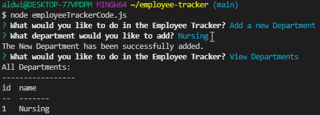
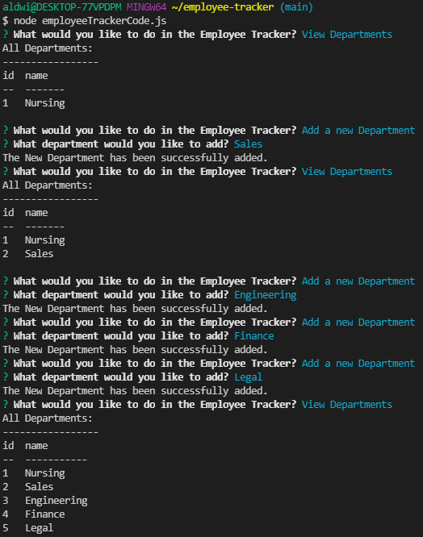
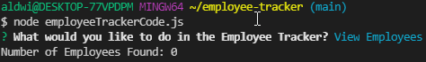
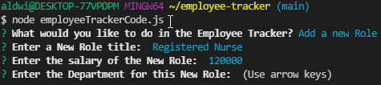
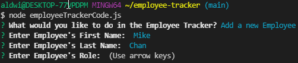

# employee-tracker

## Overview:

This project entails an employee tracker that manages the employees and their roles, salaries, departments and titles. This is achieved through using node, inquirer and MySQL Workbench.
Once the node .js is run through the terminal, the user should be prompted with various choices to pick from. Through arrow navigation, the user would be able to choose to view or add different departments, roles, and employees. Once the user is finished, they would be able to end the connection with an "End" option.

There were some difficulties that I came across especially when it came to adding a new role and employee. Even though the deparments aspect was working fine, I could not seem to let the user pick which role belonged to which department and which employee belonged to which role.

## Link to GitHub:

https://github.com/aldwinlub/employee-tracker

## Screenshots:

The initial node run and adding a department called "Nursing":

I added four more departments after "Nursing":

I viewed the employees (there are zero because I was not able to create one):

I attempted to create and add a new role:

I attempted to create and add a new employee:

